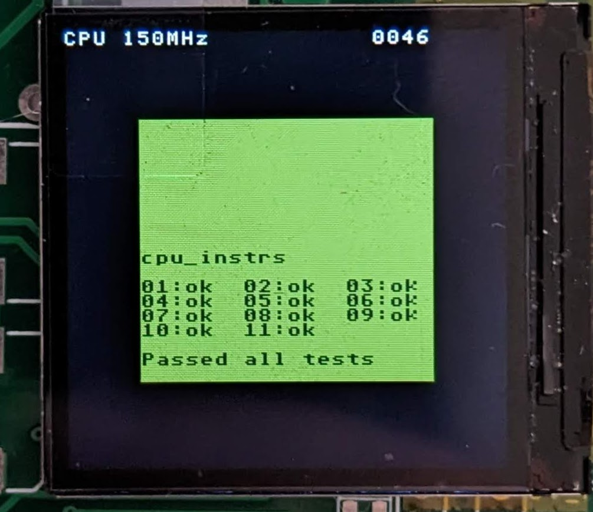

# CGBMU

CGBMU is a gameboy emulator aimed to run on microcontroller with limited memory constrains.
It is able to run on a Cortex-M3 running at 100MHz with 32kB RAM, 128kB flash and achieve 20FPS

 

# Build

CGBMU on this repository supports multiple targets and to built for all just run ´make´ command.
By default a test rom is integrated with the code and can be changed to any on that fits flash size.

For individual targets run bellow commands 

`make bb`  - Target Blueboard, NXP LPC1768 based development board.

`make disco`  - Target STM32f769I discovery board

`make artery`  - Custom board based on Artery AT32F415CBT7 low cost microcontroller

form more build rules see makefile

## Change rom

Each target has his own makefile, and to change the rom to be integrated on the final binary file the variable
*ROM_FILE* should be changed to point to a valid *.gb file.

## Porting

The code should be very easily to port for other targets since all source code does not depend on external libraries.
Some TFT controller drivers are included but again these can be ported easily to other chipsets.